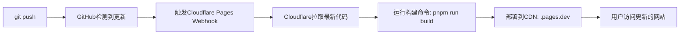

# 🔒 安全部署完整指南

## 🎯 **回答您的核心疑问**

### ❓ **部署顺序和关系**
```
正确顺序:
1️⃣ 清理敏感信息 → 2️⃣ 推送到GitHub → 3️⃣ 配置Cloudflare → 4️⃣ 开始交易

错误做法: ❌ 直接推送包含真实API密钥的代码
正确做法: ✅ 推送模板代码 + 在Cloudflare单独配置密钥
```

### ❓ **GitHub ↔ Cloudflare 工作关系**
```
GitHub Repository (代码存储)
    ↓ git push 触发
Cloudflare Pages (前端部署)
    ├── 自动检测代码更新
    ├── 运行 pnpm run build
    ├── 部署到 your-project.pages.dev
    └── 环境变量通过 Dashboard 单独设置

独立部署:
Cloudflare Workers (后端API)
    ├── 手动部署: npx wrangler deploy
    ├── 配置文件: wrangler.trading-bot.toml
    └── Secrets 通过 Dashboard 或命令行设置
```

### ❓ **您当前的问题分析**
- ✅ **Pages项目正确**: `fullstack-next-cloudflare-bots` 配置没问题
- ❌ **Workers混乱**: 3个无效Worker需要清理
- ⚠️ **敏感信息风险**: `.dev.vars`包含真实密钥(如果有的话)

## 🛡️ **立即执行的安全操作**

### 第一步：安全检查 (5分钟)
```bash
# 检查当前敏感文件状态
cat .dev.vars | grep -E "(sk-|bot[0-9]|6666)" || echo "✅ 看起来是模板值"

# 检查Git状态
git status

# 确保敏感文件被忽略
echo "检查 .gitignore 是否包含敏感文件..."
```

### 第二步：运行安全部署脚本 (10分钟)
```bash
# 运行我们创建的安全部署脚本
./scripts/secure-deploy.sh staging

# 脚本会自动:
# 1. 检查敏感文件
# 2. 清理无效Workers
# 3. 部署新Worker
# 4. 安全推送到GitHub
```

### 第三步：在Cloudflare Dashboard配置密钥 (5分钟)
```bash
# 方式1: 通过命令行
npx wrangler secret put OKX_API_KEY --config wrangler.trading-bot.toml
npx wrangler secret put OKX_SECRET --config wrangler.trading-bot.toml
npx wrangler secret put OKX_PASSPHRASE --config wrangler.trading-bot.toml

# 方式2: 通过Dashboard (推荐)
# 访问: https://dash.cloudflare.com/workers
# 选择您的Worker → Settings → Variables
```

## 📊 **具体的GitHub → Cloudflare连接机制**

### Pages 自动部署流程


### Workers 独立部署流程


## 🔧 **解决您当前的具体问题**

### 问题1: 清理无效Workers
```bash
# 登录Cloudflare
npx wrangler login

# 查看当前Workers
npx wrangler list

# 删除无效Workers
npx wrangler delete reverse-trading-bot --force
npx wrangler delete reverse-trading-bot-staging --force  
npx wrangler delete reverse-trading-bot-prod --force
```

### 问题2: 重新部署正确的Worker
```bash
# 使用正确配置部署
npx wrangler deploy --config wrangler.trading-bot.toml --env staging

# 检查部署状态
npx wrangler tail --config wrangler.trading-bot.toml --env staging
```

### 问题3: Pages项目优化
您的Pages项目配置是正确的，但建议：
```bash
# 构建命令: pnpm run build ✅ 正确
# 构建输出: .next ✅ 正确  
# 根目录: / ✅ 正确

# 建议添加环境变量 (在Dashboard中):
BETTER_AUTH_URL=https://your-domain.pages.dev
NODE_ENV=production
```

## 🎯 **您的最佳执行方案**

### 方案A: 保守方案 (推荐新手)
1. **清理重建**: 删除现有Workers，重新部署
2. **手动配置**: 通过Dashboard手动设置所有环境变量
3. **逐步测试**: 先测试环境，再生产环境

### 方案B: 专业方案 (推荐)
1. **使用安全脚本**: 运行 `./scripts/secure-deploy.sh`
2. **自动化流程**: 脚本处理大部分配置
3. **一步到位**: 直接部署到生产环境

## 🚀 **立即可执行的命令序列**

```bash
# 1. 检查安全状态
git status
cat .dev.vars | head -5

# 2. 运行安全部署
./scripts/secure-deploy.sh staging

# 3. 设置生产密钥 (在脚本提示下)
npx wrangler secret put OKX_API_KEY --config wrangler.trading-bot.toml --env staging

# 4. 测试部署
curl https://your-worker-domain.workers.dev/health

# 5. 推送到GitHub (脚本会提示)
# git add . && git commit && git push
```

## 📞 **如果遇到问题**

### 常见错误解决
```bash
# 错误1: wrangler login失败
npx wrangler logout && npx wrangler login

# 错误2: Worker部署失败  
npx wrangler dev --config wrangler.trading-bot.toml  # 本地测试

# 错误3: Pages构建失败
# 检查 package.json 中的构建脚本
```

## 🎉 **成功标志**

当您看到以下状态时，说明部署成功：
- ✅ GitHub仓库代码无敏感信息
- ✅ Cloudflare Pages自动部署成功  
- ✅ Worker正常响应健康检查
- ✅ 环境变量正确设置
- ✅ 数据库连接正常

**您准备好开始了吗？让我们执行安全部署脚本！** 🚀